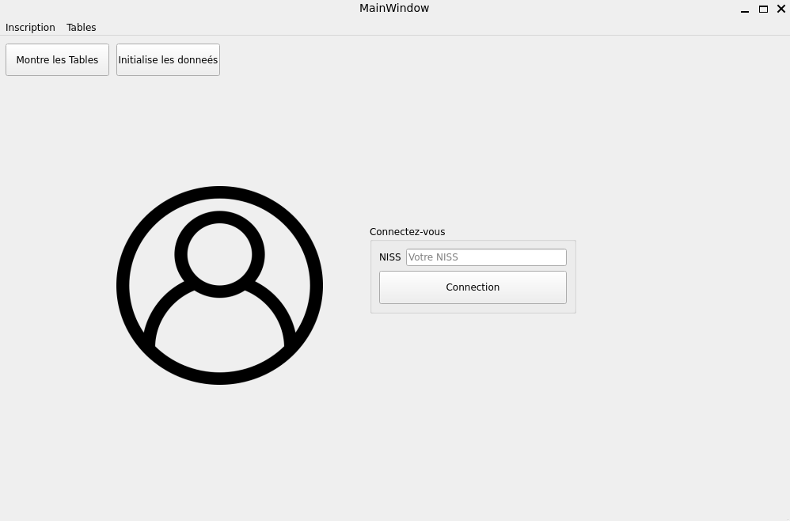

# bdd_projet1
ULB INFO-H-303 course project

## Dépendances

- c++
- la librairie c++ connector. Utilisé pour se connecter à la bdd **mysql** 
> [Lien de L'installation](https://dev.mysql.com/doc/connector-cpp/8.0/en/connector-cpp-installation-binary.html) 
> Commande pour les os **Unix** `sudo apt-get install libmysqlcppconn-dev`
- la librairie pugixml 
> [Lien de L'installation](https://pugixml.org/) 
> Commande pour les os **Unix** `sudo apt-get install libpugixml-dev`
- qtcreator, qt6.5
> [Lien de l'installateur en ligne](https://www.qt.io/download) 
- mysql
> `sudo apt install mysql-server`

## Lancer le projet

1. Démarrer le server mysql
> Pour les os **Unix** `sudo service mysql start`
2. Exécuter le script creation.sql
> Il se trouve dans `./scriptDB/creation.sql`
3. Déplacez-vous dans le dossier `./code/gui/gui/`
4. Ouvrez le projet sur qtcreator `qtcreator gui.pro`
5. Changez le répertoire de travaile à `./code/gui/gui/`
6. Exécutez le jeu avec la flèche verte `Run`

## Requêtes SQL 
Toutes les requêtes demandée se trouvent dans le dossier `./scriptDB/`

## Fonctions de l'application
1. Se connecter en tant que patient avec son **niss** 
2. Changer son *pharmacien* et *médecin* de référence  
3. Inscrire un *patient*, *médecin* et *pharmacien* (dans le menu **Inscriptions** )
4. Consulter les résultat des requête (dans le menu **Tables** )

### Apercu de l'Application:
 

Voici le lien du repo [git](https://github.com/JustRayCB/bdd_projet1) :
